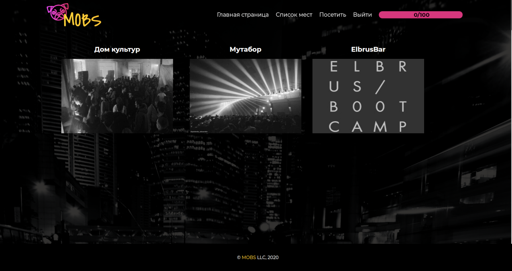
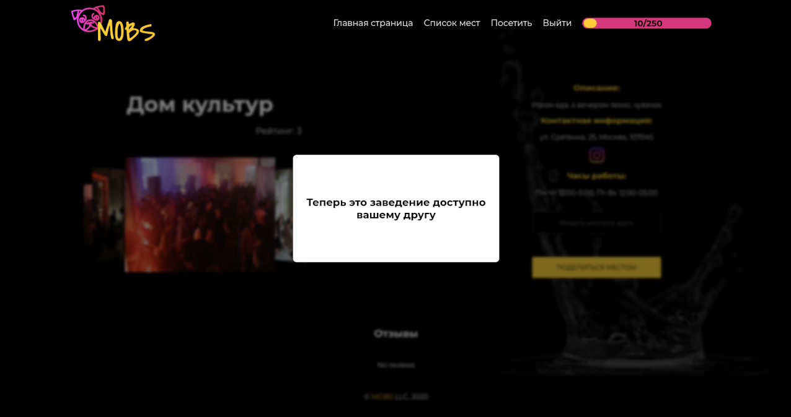

# Mobs Project

[Видеопрезентация проекта](https://www.youtube.com/watch?v=1YHSzK1BT7E&t=1800s&ab_channel=ElbrusCodingBootcamp)

MOBS — карта-путеводитель по скрытым местам Москвы. Чтобы открыть новые места на карте, нужно посетить уже доступные бары и рестораны, или попросить друга прислать приглашение. 

Наше приложение поможет Вам:
- Узнать «секретные места», куда можно забрести разве что в поисках МФЦ или ремонта обуви.
- Найти локации, которые Вы вряд ли встретите на KudaGo или TripAdvisor.

### Список технологий, использованных при разработке:

* Node.js
* React
* Redux
* Redux Saga
* Redux Toolkit
* React Router
* Yandex Maps
* MongoDB
* Express

### Порядок запуска:
1. открыть в терминале каталог server (cd server/) и набрать команду **npm i**.
2. переименовать .env.example в .env и дописать отсутствующие поля:
- PORT= порт на котором будет запущен сервер
- DB= ссылка для подключения к базе данных Atlas
- SESSION_SECRET= секретная число-буквенная комбинация
3. набрать команду **node seed.js** для наполнения базы данных
4. набрать команду **npm start**.
5. открыть новую копию терминала, перейти в папку client (cd client/) и набрать команду **npm i**.
6. набрать команду **npm start**.

Без регистрации пользователь не может получить доступ к локациям - вместо конкретных мест на карте отображаются знаки вопроса:

После прохождения регистрации

... пользователь получает доступ к трем локациям:

Также появляется вкладка со списком доступных мест:

Когда пользователь посещает одну из локаций

... ему открывается новое секретное место:

Дополнительно, пользователь может получить доступ к новому месту, если с ним данным местом поделится друг:

В данном приложении есть система рейтингов пользователей, а также рейтинг секретности мест. После регистрации пользователь 1 уровня. 
Далее при посещении мест, добавлении отзыва или отправке другу локации, пользователь набирает очки и достигает нового уровня. 
На каждом уровне пользователю доступны всё более уникальные места или места, в которые без определенной информации не попасть. 
Также друзья не могут предоставить пользователю доступ, если уровень секретности места выше, чем его рейтинг.

### Наша команда:
* [Виктор Наумов](https://github.com/jetpack024)
* [Виктор Шевченко](https://github.com/tityocheck)
* [Максим Чернощёков](https://github.com/maxche86)
* [Евгения Сыропятова](https://github.com/Marvelanda)

### Планы на будущие релизы:

1. Реализовать приложение PWA.
2. Добавить секретные локации в разных городах России и, возможно, мира :)
3. Добавить отметки в заведениях по QR-коду.
